# First NFT - DIO.me
## Repositório de documentação da entrega da criação do primeiro NFT para o curso DIO.

A seguir, relato as etapas do projeto de criação do primeiro NFT em Marketplaces demonstrados durante o curso.

O projeto sugeriu que fosse utilizada uma imagem com licença aberta para a criação do NFT. Então eu preferi gerar uma imagem por IA utilizando a plataforma do Canva (www.canva.com).

Gerei a imagem solicitando o seguinte: **"Crie uma imagem de um homem feliz por ter criado o seu primeiro NFT"** e entre os resultados, escolhi a seguinte:

## OpenSea
[https://opensea.io/](https://opensea.io/)

OpenSea é uma das principais plataformas de criação e venda de NFTs do mundo.

Cadastrei a imagem gerada na plataforma OpenSea de uma forma muito simples:

Primeiro conectei a carteira do Metamask pela rede Polygon com algumas POL para pagar a taxa de gas da rede, se necessário. Optamos por utilizar a rede Polygon, pelas suas taxas muito mais baixas, se comparadas a Ethereum.

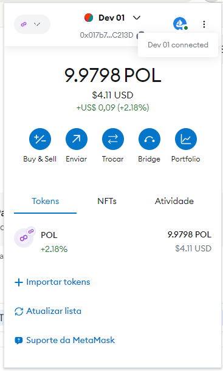

Depois, cliquei em Create e preenchi um formulário sobre o novo NFT e sobre a nova coleção de NFTs que ele faria parte.

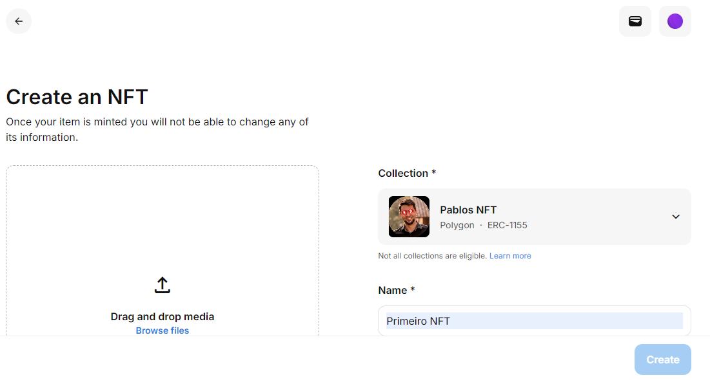

Após, fiz o upload da imagem na área destinada e cliquei no botão Create para finalizar.

Nesta etapa há uma solicitação de autorização em uma janela da wallet Metamask para permitir a sua criação.

Então, ao aprovarmos, a "mintagem" do NFT foi realizada e este pode ser listado na plataforma com o preço que achar conveniente.

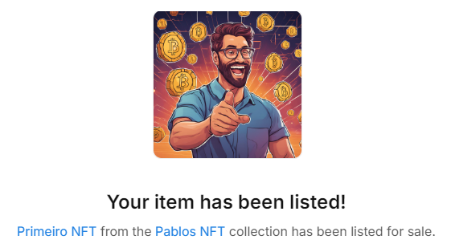

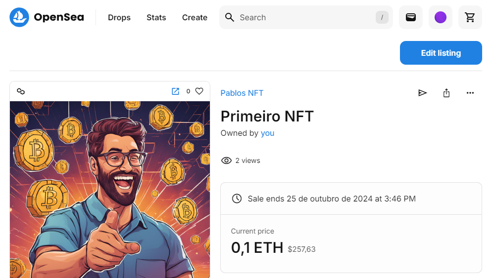

O processo foi bastante simples e super interessante.

Após a criação do NFT, ele foi enviado para a carteira solicitada no curso pelo professor Ricardo Zago:

OpenSea – Polygon: ​0xA9155F5B6FC993A82346a8ff86EFEf513fc4c096

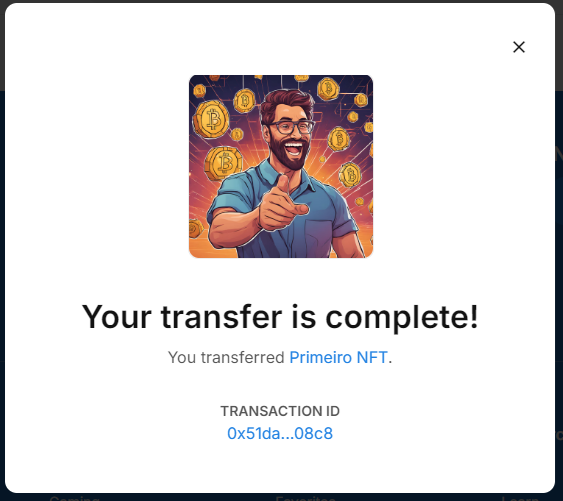
​
link da transação:

[https://polygonscan.com/tx/0x51da005a4a08abb5a7502e5d136d76eeeda07a9b698ffef3a7089dfba84008c8](https://polygonscan.com/tx/0x51da005a4a08abb5a7502e5d136d76eeeda07a9b698ffef3a7089dfba84008c8)

## Uptick
[https://irisnet.upticknft.com/](https://irisnet.upticknft.com/)

Uptick é uma plataforma muito similar ao OpenSea. É como um Marketplace de NFTs.

Nesta plataforma utilizamos a rede IrisNet e tivemos que enviar algumas moedas IRIS para a carteira para pagar o gas de mintagem e transferência na rede:

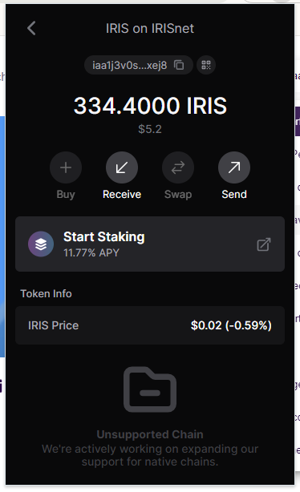

Como esta plataforma é em português, para criar um NFT cliquei em Criar e logo depois em Criar novo NFT:

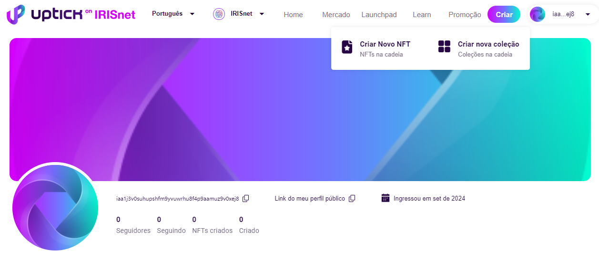

Depois fiz o upload da imagem e preenchi o formulário com informações básicas sobre o NFT. Neste caso, optei por não criar uma coleção de NFTs associada.

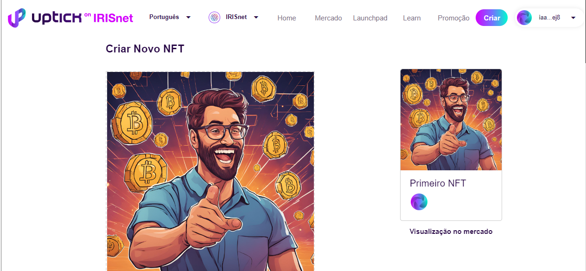

Após o formulário de criação enviado, a carteira Keplr é aberta com o pedido de confirmação da mintagem:

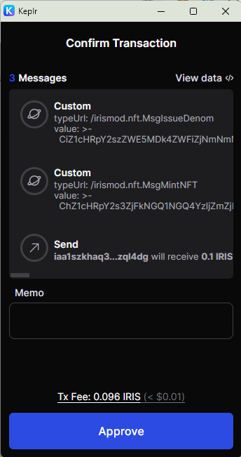

Clicando em approve na carteira, é aguardar alguns instantes para receber a mensagem de NFT gerado com sucesso. Então é possível visualizar em seu perfil e colocá-lo a venda, se for o caso.

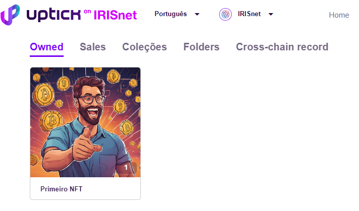

Neste caso, o NFT não foi listado na plataforma e, ao invés disso, foi enviado para a carteira solicitada no curso:

Uptick​ Irisnet: iaa1ld2ck02x0909lg5tkqwdkfnsnsz7mmg6952jar

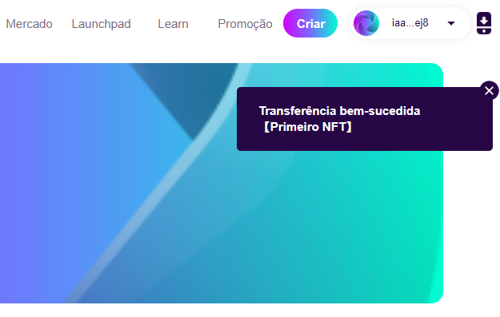

link da transação:

[https://irishub.iobscan.io/#/txs/C03FFCCBFEDFD73BE2D3FEC674C48CA1B6AFA3F17B766860B6E67291EA3EDA34](https://irishub.iobscan.io/#/txs/C03FFCCBFEDFD73BE2D3FEC674C48CA1B6AFA3F17B766860B6E67291EA3EDA34)
